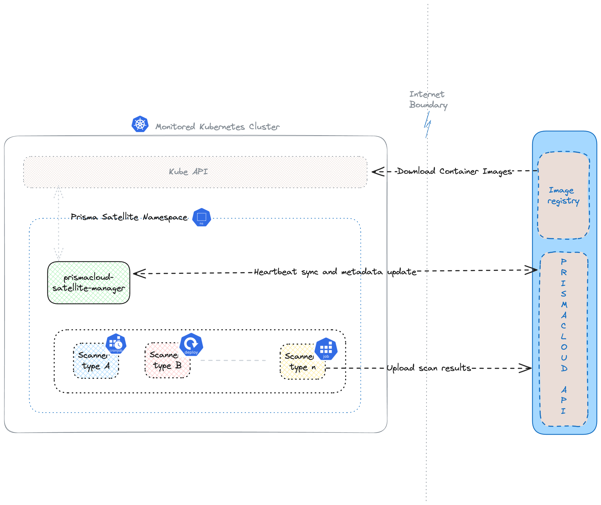

= Concepts
Alexandre Cezar <acezar@paloaltonetworks.com>, August 31, 2023:
:toc:
:toc-title:
:icons: font

Learn about the critical components of Prisma Cloud Satellite

== Satellite Application
Satellite manages and orchestrates the lifecycle of all the Prisma Cloud K8s capabilities, expect for the Defender. +
In its initial release, only one function is available (Discovery), but in the future, customers will be able to select additional ones, based on their unique requirements and needs.

== Discovery Function
Discover is a basic function of Satellite, which allows Prisma Cloud to get visibility of K8s configurations and DNS requests. Discovery is a key component of AppDNA and K8s container exposure features of Prisma Cloud +

== Prisma Cloud User Interface
Web UI used to deploy and manage the Satellite Application  +

== Prisma Cloud APIs
To fully automate the deployment of Satellite application, customers can make usage Prisma Cloud APIs+

== Architecture

Prismacloud Satellite consists of two components, Satellite Manager and Scanner Jobs. Satellite Manager is responsible for send satellite's heartbeat back to Prismacloud and keep the scan configs and metadata updated locally.
Scanner Jobs are spawned by manager based on scan config and metadata. Scanner jobs can be periodic, on demand or continuously running similar to a deployment. These  jobs upload scan results back to Prismacloud.

