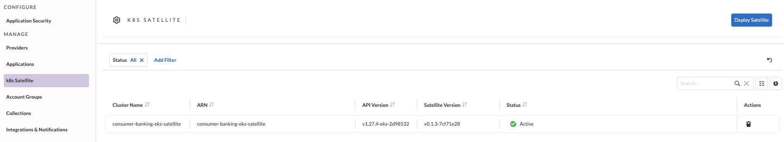
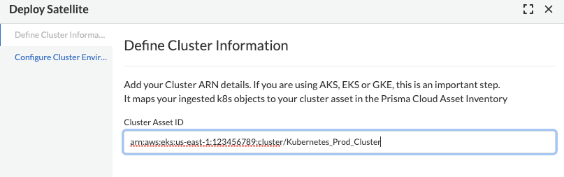
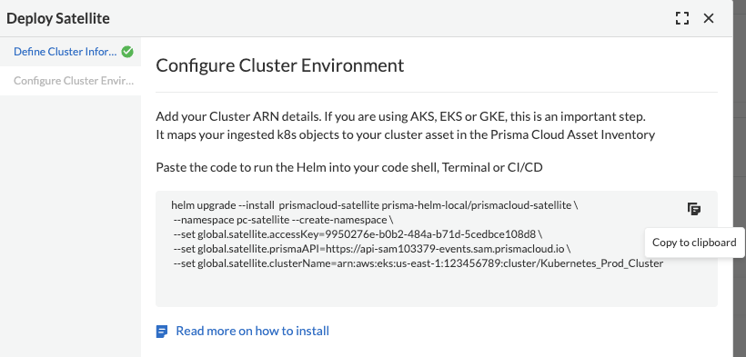
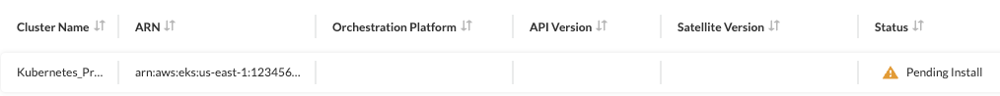
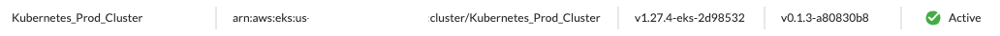
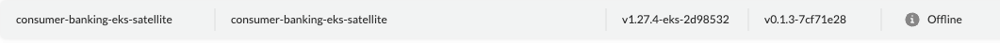

= Install Prisma Cloud K8s Satellite
Alexandre Cezar <acezar@paloaltonetworks.com> 1.0, August 31, 2023:
:toc:
:toc-title:
:toclevels: 4
:icons: font

== System Requirements
If you are not familiar with Satellite requirements, please refer to this https://github.com/alexandre-cezar/satellite-docs/blob/main/System_Requirements.adoc[page]

== Satellite Installation

The steps below cover the Satellite installation +

* Step 1 - Navigate to Prisma Cloud/Settings/K8s Satellite and click on `Deploy Satellite`. +

* Step 2 - Click on Deploy Satellite and provide the Cluster Identifier.

[IMPORTANT]
You can find your Cluster Asset ID by looking into the Cluster `Asset ID` field information on the Prisma Cloud Asset Inventory.

* Step 3 - Copy the Helm chart and run it at your cluster.

[WARNING]
A unique identifier is generated at each time a helm chart is generated and it acts as a cluster identifier, therefore you cannot reuse the helm chart across different clusters.

Right after the helm chart is generated, your cluster will be on `Pending` state, until Satellite gets deployed and starts reporting to Prisma Cloud

After the deployment is done, the cluster status will change to a `Ready`
state.

Once a cluster moves to a `Ready` state, it will continuously sending keep-alives to Prisma Cloud every 30 minutes. If there's a communication issue or if the Satellite gets removed, the object will move into a `Offline` state until the communication is reestablished or the Satellite object is deleted in the Prisma Cloud console.

